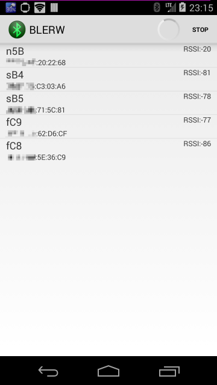
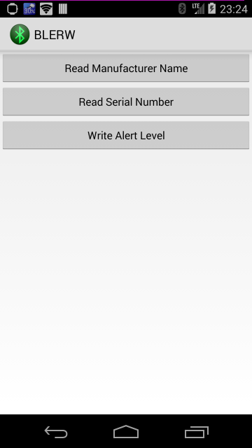

1.实现 ble 扫描
2.连接特定的Characteristic
3.自动使能notify,并修改mtu为200
4.写Characteristic

移植自:https://github.com/youten/BLERW
=====

Android BLE Scan and Characteristics Read/Write Example

 

# License

Apache License Version 2.0
